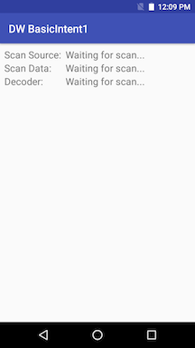

# BasicIntent1

*This application is intended for demonstration purposes only. It is provided as-is without guarantee or warranty and may be modified to suit individual needs.*
=========================================================

This sample demonstrates how to use DataWedge to receive scanned barcode data through an Android intent.

Available actions in this sample:

* Display the following for each decoded barcode: 
     * scan source
     * scan data
     * decoder type

Refer to Zebra TechDocs: http://techdocs.zebra.com/datawedge/latest/guide/samples/basicintent1/

