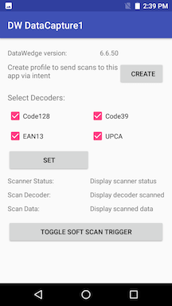

# DataCapture1

*This application is intended for demonstration purposes only. It is provided as-is without guarantee or warranty and may be modified to suit individual needs.*
=========================================================

This sample app demonstrates DataWedge barcode scanning, configuration, scanner status notification and soft scan trigger using [DataWedge Intent APIs](http://techdocs.zebra.com/datawedge/latest/guide/api/).

Available actions in this sample:

* Display the DataWedge version
* Create a profile if it does not exist
* Select/deselect certain decoders for scanning
* Set the default scanner (auto) as the selected scanner
* Toggle software scan trigger
* Register for scanner status notifications, such as waiting, scanning, etc.
* Display the following for each decoded barcode: 
   * scan data
   * decoder type

Refer to Zebra TechDocs: http://techdocs.zebra.com/datawedge/latest/guide/samples/barcode1/

