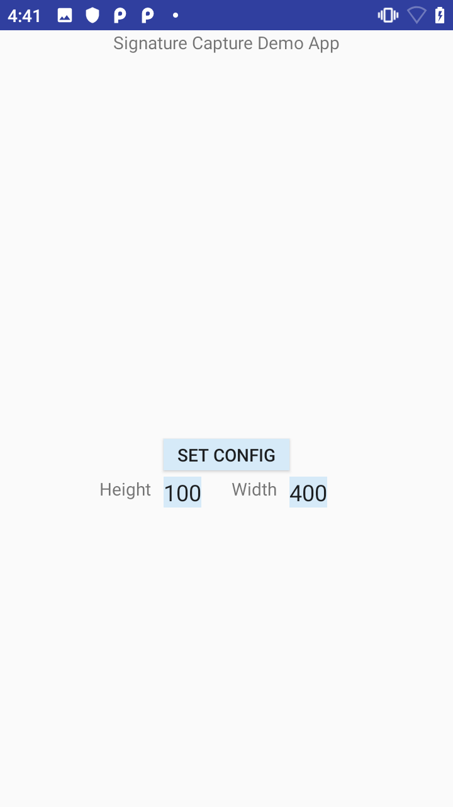

# SignatureCapture1

*This application is intended for demonstration purposes only. It is provided as-is without guarantee or warranty and may be modified to suit individual needs.*
=========================================================

This sample app demonstrates how to capture data from [Decoder Signature](http://techdocs.zebra.com/datawedge/latest/guide/input/barcode/#decodersignature) in .JPG (default) and .BMP formats using [DataWedge Intent API](http://techdocs.zebra.com/datawedge/latest/guide/api/). **_It applies to DataWedge versions 7.3 to 8.1._**

Available actions in this sample:

* Create a DatatWedge profile if it does not exist, configure it with specific parameters, and associate it with this app.
* Adjust the height and width of the image output.
* Scan and display the captured data as an image.
* Save the image file to the device.

Refer to Zebra TechDocs: http://techdocs.zebra.com/datawedge/8-1/guide/samples/signaturecapture/

